# 单轮语音交互时序图

本文档描述 WebUI、Bridge、EchoKit Server 三者之间单轮语音交互的完整时序流程。

## 时序图

```mermaid
sequenceDiagram
    participant WebUI
    participant VAD as VAD (Client)
    participant Bridge
    participant EchoKit as EchoKit Server

    Note over WebUI,EchoKit: 初始化阶段
    WebUI->>Bridge: WebSocket连接 (ws://bridge/ws/{visitor_id})
    Bridge-->>WebUI: 连接成功

    WebUI->>Bridge: StartChat命令 (JSON)
    Note right of WebUI: {"event": "StartChat"}

    Bridge->>Bridge: 创建会话和session_id
    Bridge->>EchoKit: WebSocket连接并创建会话
    Note right of Bridge: OpenAI session.create

    EchoKit-->>Bridge: 问候序列开始
    EchoKit-->>Bridge: HelloStart (MessagePack)
    Bridge->>Bridge: 清空缓存，启用缓存标志
    Bridge-->>WebUI: HelloStart (MessagePack Binary)

    loop 问候语音块
        EchoKit-->>Bridge: HelloChunk (MessagePack + PCM16)
        Bridge->>Bridge: 缓存 HelloChunk
        Bridge-->>WebUI: HelloChunk (Binary)
        WebUI->>WebUI: 解码并播放PCM16音频
    end

    EchoKit-->>Bridge: HelloEnd (MessagePack)
    Bridge->>Bridge: 缓存 HelloEnd，禁用缓存标志
    Bridge-->>WebUI: HelloEnd (Binary)
    WebUI->>WebUI: 问候播放完成

    Note over WebUI,EchoKit: 用户语音输入阶段

    VAD->>VAD: 检测到语音开始
    VAD->>WebUI: onSpeechStart()
    WebUI->>WebUI: 显示"正在聆听..."

    loop 用户说话中
        VAD->>VAD: 捕获音频帧 (16kHz PCM16)
        VAD->>WebUI: onFrameProcessed(audio)
        WebUI->>Bridge: 发送音频数据 (Binary WebSocket)
        Bridge->>EchoKit: 转发音频 (conversation.item.create)
        Note right of Bridge: input_audio_buffer.append
    end

    VAD->>VAD: 检测到语音结束 (静音)
    VAD->>WebUI: onSpeechEnd(audio)
    WebUI->>WebUI: 显示"处理中..."
    WebUI->>Bridge: 发送完整音频 (Binary)
    Bridge->>EchoKit: 提交音频缓冲区
    Note right of Bridge: input_audio_buffer.commit

    Bridge->>EchoKit: 触发响应生成
    Note right of Bridge: response.create

    Note over WebUI,EchoKit: ASR识别阶段

    EchoKit->>EchoKit: 执行ASR转录
    EchoKit-->>Bridge: ASRStart (MessagePack)
    Bridge-->>WebUI: ASRStart

    loop ASR增量结果
        EchoKit-->>Bridge: ASRChunk (MessagePack)
        Note left of EchoKit: {"ASRChunk": [{"text": "..."}]}
        Bridge->>Bridge: 提取text字段
        Bridge-->>WebUI: ASRChunk (Binary)
        WebUI->>WebUI: 显示增量转录文本
    end

    EchoKit-->>Bridge: ASREnd (MessagePack)
    Bridge-->>WebUI: ASREnd
    WebUI->>WebUI: 确认转录完成

    Note over WebUI,EchoKit: AI响应生成阶段

    EchoKit->>EchoKit: LLM生成文本响应
    EchoKit-->>Bridge: ResponseTextStart

    loop 文本流式输出
        EchoKit-->>Bridge: ResponseTextChunk
        Note left of EchoKit: {"text": "..."}
        Bridge-->>WebUI: ResponseTextChunk
        WebUI->>WebUI: 显示AI回答文本
    end

    EchoKit-->>Bridge: ResponseTextEnd

    Note over WebUI,EchoKit: TTS语音生成阶段

    EchoKit->>EchoKit: TTS合成语音
    EchoKit-->>Bridge: StartAudio (MessagePack)
    Bridge-->>WebUI: StartAudio
    WebUI->>WebUI: 准备音频播放队列

    loop TTS音频块
        EchoKit-->>Bridge: AudioChunk (MessagePack + PCM16)
        Note left of EchoKit: {"AudioChunk": [[binary_data]]}
        Bridge->>Bridge: 提取音频数据
        Bridge-->>WebUI: AudioChunk (Binary)
        WebUI->>WebUI: 加入播放队列并播放
    end

    EchoKit-->>Bridge: EndAudio (MessagePack)
    Bridge-->>WebUI: EndAudio
    WebUI->>WebUI: 音频播放完成

    EchoKit-->>Bridge: EndResponse (MessagePack)
    Bridge-->>WebUI: EndResponse
    WebUI->>WebUI: 单轮对话完成，准备下一轮

    Note over WebUI,EchoKit: 可以开始下一轮对话
```



## 阶段说明

### 1. 初始化阶段
- **WebUI → Bridge**: 建立WebSocket连接
- **WebUI → Bridge**: 发送 `StartChat` 命令（JSON格式）
- **Bridge**: 创建会话ID，绑定设备
- **Bridge → EchoKit**: 建立WebSocket连接，发送 `session.create`
- **EchoKit → WebUI**: 返回问候语音序列
  - `HelloStart`: 问候开始标记
  - `HelloChunk`: 问候语音块（多个，包含PCM16音频数据）
  - `HelloEnd`: 问候结束标记

### 2. 用户语音输入阶段
- **VAD**: 客户端Voice Activity Detection检测语音活动
- **检测到语音开始**:
  - VAD触发 `onSpeechStart()` 回调
  - WebUI显示"正在聆听..."状态
- **语音采集循环**:
  - VAD持续捕获16kHz PCM16音频帧
  - VAD触发 `onFrameProcessed(audio)` 回调
  - WebUI通过WebSocket实时发送音频数据到Bridge
  - Bridge转发音频到EchoKit (`input_audio_buffer.append`)
- **检测到语音结束**:
  - VAD检测到静音，触发 `onSpeechEnd(audio)` 回调
  - WebUI发送完整音频并显示"处理中..."
  - Bridge提交音频缓冲区 (`input_audio_buffer.commit`)
  - Bridge触发响应生成 (`response.create`)

### 3. ASR识别阶段
- **EchoKit**: 执行语音转文本识别
- **ASR流式结果**:
  - `ASRStart`: 转录开始
  - `ASRChunk`: 增量转录结果（MessagePack格式，包含 `{"ASRChunk": [{"text": "..."}]}`）
  - Bridge提取text字段并转发
  - WebUI实时显示增量转录文本
  - `ASREnd`: 转录结束

### 4. AI响应生成阶段
- **EchoKit**: LLM处理用户输入，生成文本响应
- **文本流式输出**:
  - `ResponseTextStart`: 响应开始
  - `ResponseTextChunk`: 流式文本块（包含 `{"text": "..."}`）
  - WebUI实时显示AI回答
  - `ResponseTextEnd`: 文本响应结束

### 5. TTS语音生成阶段
- **EchoKit**: 将文本响应转换为语音
- **音频流式输出**:
  - `StartAudio`: 音频开始
  - `AudioChunk`: 音频块（MessagePack格式，包含 `{"AudioChunk": [[binary_pcm16_data]]}`）
  - Bridge提取音频数据
  - WebUI加入播放队列并播放
  - `EndAudio`: 音频结束
  - `EndResponse`: 整轮响应结束

## 数据格式

### WebSocket消息格式

#### 控制命令（WebUI → Bridge，JSON格式）
```json
{
  "event": "StartChat"
}
```

#### 音频数据（WebUI ↔ Bridge，Binary格式）
- 原始PCM16音频数据
- 采样率: 16kHz
- 位深: 16-bit
- 声道: 单声道

#### MessagePack事件（Bridge ↔ EchoKit，Binary MessagePack格式）

**字符串事件**:
```
"HelloStart"
"HelloEnd"
"StartAudio"
"EndAudio"
"EndResponse"
```

**对象事件**:
```javascript
// HelloChunk/AudioChunk
{
  "HelloChunk": [[binary_pcm16_data]]
}
{
  "AudioChunk": [[binary_pcm16_data]]
}

// ASRChunk
{
  "ASRChunk": [
    {
      "text": "用户说的话...",
      "confidence": 0.95,
      "is_final": false
    }
  ]
}

// ResponseTextChunk
{
  "ResponseTextChunk": {
    "text": "AI回答的文字...",
    "delta": "新增的文字"
  }
}
```

## 潜在问题点（用户语音无响应分析）

根据时序图，用户语音无响应可能出现在以下环节：

1. **VAD检测问题**
   - VAD没有正确检测到语音结束
   - 音频一直在发送但没有触发 `onSpeechEnd`
   - 需要检查VAD配置和静音检测阈值

2. **音频转发问题**
   - Bridge没有正确转发音频到EchoKit
   - 音频格式不匹配（期望PCM16但收到其他格式）
   - 需要检查Bridge的音频转发日志

3. **EchoKit处理问题**
   - EchoKit没有收到足够的音频数据
   - `input_audio_buffer.commit` 没有被调用
   - `response.create` 没有被触发
   - 需要检查EchoKit Server的响应

4. **ASR结果返回问题**
   - EchoKit没有返回ASR结果
   - ASRChunk的text字段为空或格式错误
   - Bridge没有正确提取和转发text字段
   - 需要检查MessagePack解析逻辑

5. **WebUI显示问题**
   - WebUI没有正确处理ASRChunk消息
   - MessagePack解码失败
   - UI没有更新显示转录文本
   - 需要检查WebUI的消息处理逻辑

## 调试建议

### 检查日志关键点

1. **WebUI侧**:
   - VAD `onSpeechStart` / `onSpeechEnd` 回调
   - WebSocket发送音频数据的数量和大小
   - 接收到的MessagePack消息类型

2. **Bridge侧**:
   - 收到的音频数据大小和频率
   - 转发到EchoKit的音频数据
   - 收到的EchoKit响应类型
   - ASRChunk的text字段提取

3. **EchoKit侧**:
   - 收到的音频数据统计
   - ASR转录结果
   - 响应生成状态

### 常见问题排查

- **问题**: 用户说话后没有任何反应
  - **排查**: 检查VAD是否触发 `onSpeechEnd`
  - **排查**: 检查Bridge是否调用 `input_audio_buffer.commit`

- **问题**: 有ASR转录但没有AI回复
  - **排查**: 检查Bridge是否调用 `response.create`
  - **排查**: 检查EchoKit是否返回ResponseTextChunk

- **问题**: 转录文本不显示
  - **排查**: 检查Bridge是否正确提取ASRChunk的text字段
  - **排查**: 检查WebUI是否正确解码MessagePack
  - **排查**: 检查WebUI是否正确处理ASR事件并更新UI

- **问题**: 音频播放但没有转录
  - **排查**: 音频数据格式是否正确（PCM16 16kHz）
  - **排查**: 音频数据是否完整发送
  - **排查**: EchoKit是否正常工作
