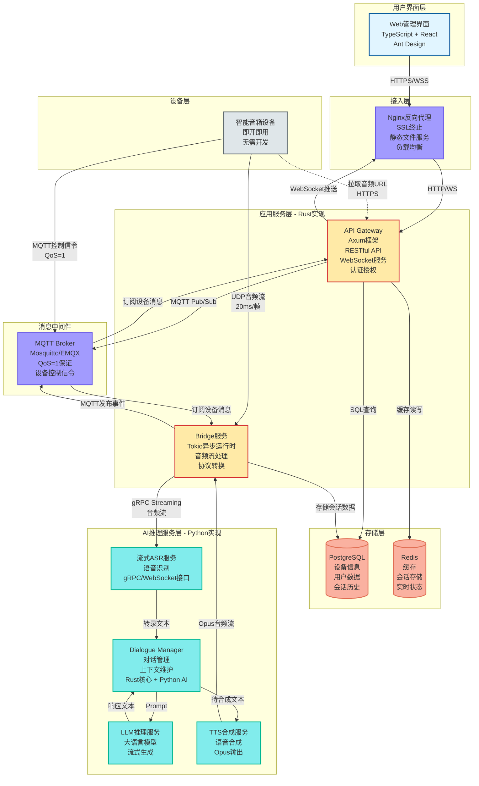
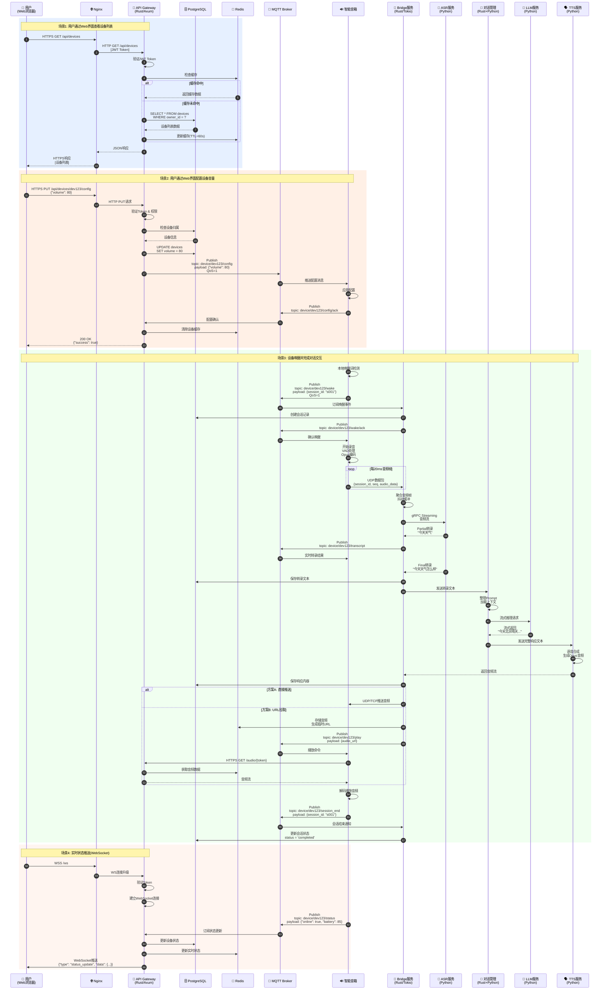
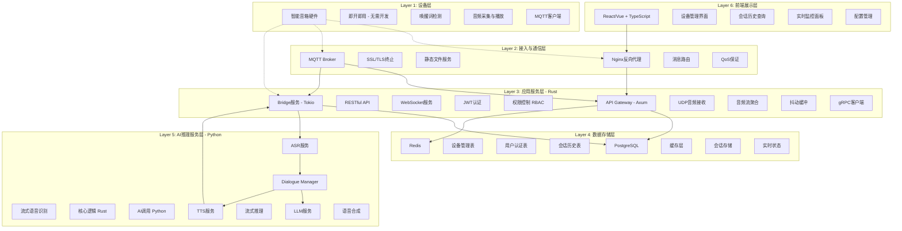
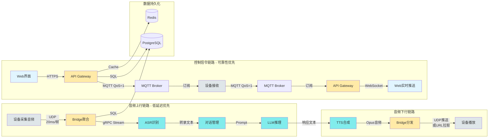
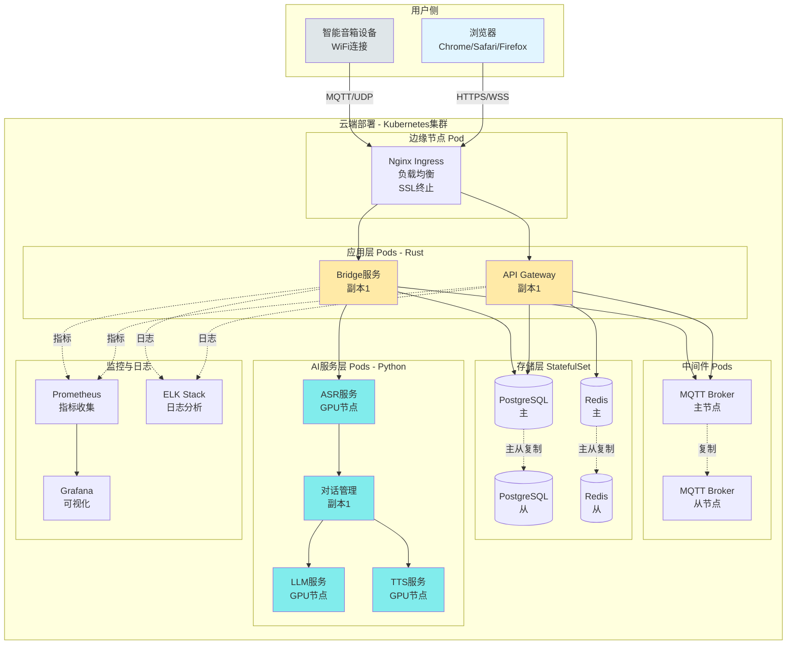
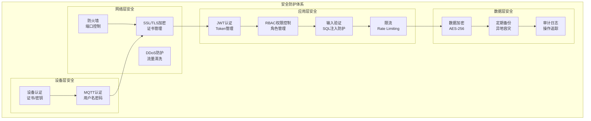
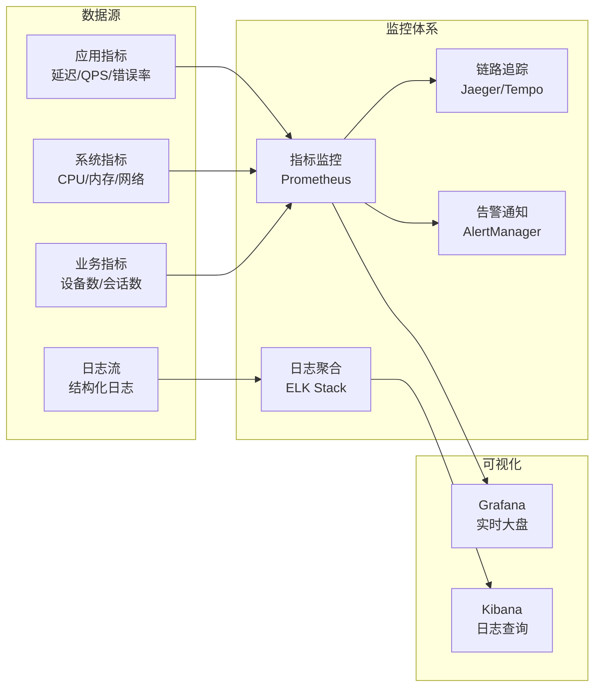

# 智能音箱端到端系统完整架构

## 系统架构总览



## 详细交互时序图

### 场景概述

系统涉及四个核心交互场景：
1. **场景1：设备列表查询** - 典型的Web管理操作，展示缓存策略
2. **场景2：设备远程配置** - Web到设备的控制链路，展示MQTT消息流
3. **场景3：语音交互全流程** - 核心业务场景，展示音频处理和AI推理完整链路
4. **场景4：实时状态推送** - WebSocket双向通信，展示实时监控能力

### 时序图



### 场景详细说明

#### 场景1: 用户通过Web界面查看设备列表

**业务场景**：用户登录Web管理界面后，查看自己名下的所有智能音箱设备。

**流程说明**：
1. **用户发起请求**：用户在浏览器中访问设备列表页面，前端发起HTTPS GET请求到 `/api/devices`
2. **Nginx转发**：Nginx作为反向代理，接收HTTPS请求并转发给后端API Gateway
3. **身份验证**：API Gateway首先验证请求中的JWT Token，确认用户身份合法
4. **缓存检查**：验证通过后，Gateway先查询Redis缓存
   - **缓存命中**：如果缓存存在且未过期，直接返回缓存数据（快速路径）
   - **缓存未命中**：查询PostgreSQL数据库获取该用户的设备列表
5. **数据库查询**：执行SQL `SELECT * FROM devices WHERE owner_id = ?`，获取用户的所有设备
6. **更新缓存**：将查询结果写入Redis缓存，设置TTL为60秒
7. **返回响应**：Gateway返回JSON格式的设备列表，经Nginx转发回用户浏览器

**技术要点**：
- 使用Redis缓存减少数据库访问压力
- JWT Token保证API安全性
- 缓存TTL设置平衡实时性和性能

**性能指标**：
- 缓存命中时延迟：< 50ms
- 缓存未命中时延迟：< 200ms

---

#### 场景2: 用户通过Web界面配置设备音量

**业务场景**：用户在Web界面上调整某个智能音箱的音量，系统需要将配置实时推送到设备。

**流程说明**：
1. **用户提交配置**：用户在设备详情页调整音量滑块，前端发起HTTPS PUT请求到 `/api/devices/dev123/config`，Body包含 `{"volume": 80}`
2. **身份和权限验证**：API Gateway验证JWT Token，并检查用户是否有权限配置该设备
3. **设备归属验证**：从PostgreSQL查询设备信息，确认该设备属于当前用户
4. **更新数据库**：执行SQL `UPDATE devices SET volume = 80 WHERE id = 'dev123'`，持久化配置
5. **发布MQTT消息**：Gateway通过MQTT Broker发布消息到主题 `device/dev123/config`，QoS设为1保证消息至少送达一次
6. **设备接收并应用**：智能音箱订阅了该主题，接收到消息后立即调整音量
7. **设备确认**：设备应用配置后，发布确认消息到 `device/dev123/config/ack`
8. **清除缓存**：Gateway接收到确认后，清除Redis中该设备的缓存，确保下次查询获取最新数据
9. **返回成功**：Gateway返回200 OK，前端显示配置成功提示

**技术要点**：
- MQTT QoS=1保证控制命令可靠送达
- 数据库先更新再发送MQTT，保证配置持久化
- 缓存失效策略保证数据一致性
- 设备ACK机制提供可靠反馈

**交互模式**：
- Web → API Gateway → MQTT → Device（控制流）
- Device → MQTT → API Gateway（反馈流）

---

#### 场景3: 设备唤醒并完成对话交互（核心场景）

**业务场景**：用户对智能音箱说"小智小智，今天天气怎么样？"，设备完成从唤醒、识别、推理到语音播放的完整交互。

**流程说明**：

**阶段1：唤醒与会话建立**
1. **本地唤醒检测**：设备通过本地算法检测到唤醒词"小智小智"
2. **发布唤醒事件**：设备通过MQTT发布消息到 `device/dev123/wake`，包含新生成的会话ID `session_id: "s001"`
3. **Bridge响应**：Bridge服务订阅了唤醒事件，接收到消息后在PostgreSQL中创建会话记录
4. **确认唤醒**：Bridge发布ACK消息，设备收到后进入录音模式

**阶段2：音频采集与上传**
5. **开始录音**：设备启动麦克风采集，同时进行VAD（语音活动检测）处理
6. **音频编码**：将音频编码为Opus格式，每20ms生成一个音频帧
7. **UDP传输**：设备通过UDP协议将音频帧发送给Bridge服务，每个数据包包含 `{session_id, seq, audio_data}`
   - 使用UDP而非TCP，优先低延迟而非可靠性
   - 序列号seq用于检测丢包和乱序

**阶段3：语音识别**
8. **音频流聚合**：Bridge接收UDP数据包，进行抖动缓冲处理，平滑网络波动
9. **转发ASR**：Bridge通过gRPC Streaming将音频流转发给ASR服务
10. **实时转录**：ASR返回部分转录结果（Partial Transcript）如"今天天气"，Bridge通过MQTT推送给设备（可选用于回声显示）
11. **最终转录**：ASR返回完整转录结果"今天天气怎么样"
12. **保存转录**：Bridge将最终转录文本保存到PostgreSQL

**阶段4：对话管理与LLM推理**
13. **发送到DM**：Bridge将转录文本发送给Dialogue Manager
14. **整理Prompt**：DM加载用户的历史对话上下文，整理成完整的Prompt
15. **调用LLM**：DM向LLM服务发起流式推理请求
16. **流式返回**：LLM流式生成响应"今天北京晴天，最高气温25度..."
   - 流式生成降低首字延迟，用户体验更好

**阶段5：语音合成**
17. **TTS合成**：DM将完整响应文本发送给TTS服务
18. **生成音频**：TTS将文本合成为Opus格式的音频流
19. **返回Bridge**：TTS将音频流返回给Bridge服务
20. **保存响应**：Bridge将响应内容保存到PostgreSQL

**阶段6：音频下发与播放**
- **方案A（直接推送）**：Bridge通过UDP/TCP直接推送音频数据到设备
- **方案B（URL拉取）**：
  - Bridge将音频临时存储到Redis，生成带有Token的URL
  - 通过MQTT发送播放命令给设备，包含音频URL
  - 设备通过HTTPS从API Gateway拉取音频数据
  - Gateway从Redis获取音频并返回

21. **播放音频**：设备解码Opus音频并通过扬声器播放
22. **会话结束**：播放完成后，设备发布会话结束消息到 `device/dev123/session_end`
23. **更新状态**：Bridge更新PostgreSQL中的会话状态为 `completed`

**技术要点**：
- UDP音频传输优先低延迟，容忍少量丢包
- 流式处理链路：ASR流式识别 + LLM流式生成，降低端到端延迟
- gRPC Streaming保证Bridge到ASR的可靠传输
- 抖动缓冲平滑网络波动
- 会话ID贯穿整个流程，便于追踪和调试

**性能指标**：
- 唤醒到录音：< 100ms
- ASR首字延迟：< 500ms
- LLM首Token：< 2s
- 端到端总延迟：< 3s

**数据流**：
```
设备 → UDP → Bridge → gRPC → ASR → HTTP → DM → HTTP → LLM
                ↓                                      ↓
            PostgreSQL                              TTS
                                                     ↓
设备 ← UDP/HTTPS ← Bridge ← Opus音频流 ← TTS
```

---

#### 场景4: 实时状态推送（WebSocket）

**业务场景**：用户打开Web管理界面后，需要实时看到设备的在线状态、电量等信息变化。

**流程说明**：
1. **建立WebSocket连接**：
   - 用户浏览器发起WSS连接请求到 `/ws`
   - Nginx将WebSocket连接升级请求转发给API Gateway
   - Gateway验证JWT Token确保安全性
   - 验证通过后建立持久化WebSocket连接

2. **设备状态上报**：
   - 智能音箱定期（如每30秒）通过MQTT发布状态消息到 `device/dev123/status`
   - Payload包含：`{"online": true, "battery": 85, "volume": 80, "temperature": 35}`

3. **Gateway订阅与处理**：
   - API Gateway订阅了所有设备的状态主题 `device/+/status`
   - 接收到设备状态消息后：
     - 更新PostgreSQL中的设备状态（持久化）
     - 更新Redis中的实时状态（快速查询）
     - 判断哪些WebSocket连接需要接收该设备状态（权限过滤）

4. **实时推送**：
   - Gateway通过WebSocket推送消息给所有有权限的在线用户
   - 推送格式：`{"type": "status_update", "device_id": "dev123", "data": {"online": true, "battery": 85}}`
   - 前端接收后实时更新UI，用户无需刷新页面

**技术要点**：
- WebSocket保持长连接，避免HTTP轮询开销
- MQTT订阅通配符 `device/+/status` 监听所有设备
- 权限过滤：只推送用户有权查看的设备状态
- 双重存储：PostgreSQL持久化 + Redis实时缓存
- 心跳机制：检测WebSocket连接存活

**优势**：
- ✅ 实时性高：设备状态变化立即推送，延迟< 1s
- ✅ 服务器资源友好：避免大量HTTP轮询请求
- ✅ 用户体验好：界面实时更新，无需手动刷新

**扩展应用**：
- 会话进度通知（正在识别、正在思考、正在合成）
- 设备异常告警（离线、低电量、高温）
- 系统通知（固件更新可用）

---

### 场景对比总结

| 场景 | 通信协议 | 数据流向 | 核心目标 | 延迟要求 |
|------|---------|---------|---------|---------|
| 场景1：查询设备 | HTTPS | Web → Gateway → DB/Cache | 快速查询 | < 200ms |
| 场景2：配置设备 | HTTPS + MQTT | Web → Gateway → MQTT → Device | 可靠控制 | < 1s |
| 场景3：语音交互 | UDP + gRPC + MQTT | Device → Bridge → AI → Device | 低延迟交互 | < 3s |
| 场景4：状态推送 | MQTT + WebSocket | Device → MQTT → Gateway → Web | 实时监控 | < 1s |

**设计理念**：
- **查询场景**：缓存优先，提升响应速度
- **控制场景**：MQTT QoS保证，确保命令送达
- **音频场景**：UDP + 流式处理，极致低延迟
- **推送场景**：WebSocket长连接，减少开销

## 技术架构分层视图



## 数据流向图



## 部署架构图



## 核心技术栈总结

### 前端层
| 组件 | 技术选型 | 说明 |
|------|---------|------|
| UI框架 | React 18 + TypeScript | 类型安全,生态丰富 |
| 状态管理 | Zustand / Redux Toolkit | 轻量级状态管理 |
| UI组件库 | Ant Design | 企业级组件库 |
| 数据请求 | TanStack Query | 数据获取与缓存 |
| 实时通信 | WebSocket API | 实时状态推送 |
| 构建工具 | Vite | 快速构建 |

### 后端层 (Rust)
| 组件 | 技术选型 | 说明 |
|------|---------|------|
| API Gateway | Axum | 现代化Web框架 |
| Bridge服务 | Tokio | 异步运行时 |
| gRPC客户端 | Tonic | gRPC框架 |
| MQTT客户端 | rumqttc | MQTT 3.1.1/5.0 |
| 数据库访问 | sqlx | 异步SQL |
| 音频编解码 | opus | Opus编解码 |
| 认证 | jsonwebtoken | JWT |

### 中间件层
| 组件 | 技术选型 | 说明 |
|------|---------|------|
| 反向代理 | Nginx | SSL终止,负载均衡 |
| 消息代理 | Mosquitto/EMQX | MQTT Broker |
| 关系数据库 | PostgreSQL 15+ | 事务支持 |
| 缓存 | Redis 7+ | 高性能缓存 |

### AI服务层 (Python)
| 组件 | 技术选型 | 说明 |
|------|---------|------|
| ASR | FastAPI + 模型 | 流式语音识别 |
| LLM | vLLM / TGI | 流式推理 |
| TTS | FastAPI + 模型 | 语音合成 |
| 对话管理 | Rust核心 + Python | 混合实现 |

### 基础设施
| 组件 | 技术选型 | 说明 |
|------|---------|------|
| 容器编排 | Kubernetes | 微服务部署 |
| 容器运行时 | Docker | 容器化 |
| 监控 | Prometheus + Grafana | 指标监控 |
| 日志 | ELK Stack | 日志分析 |
| CI/CD | GitHub Actions | 自动化部署 |

## 关键性能指标

### 延迟要求
- **唤醒响应**: < 100ms
- **音频上传**: 20ms/帧 (实时)
- **ASR识别**: < 500ms (首字延迟)
- **LLM推理**: < 2s (首Token)
- **TTS合成**: < 1s
- **端到端**: < 3s (从说话到播放)

### 吞吐量要求
- **并发设备**: 10,000+ 设备同时在线
- **API QPS**: 5,000+ 请求/秒
- **音频流**: 1,000+ 并发流
- **WebSocket连接**: 10,000+ 并发连接

### 可用性要求
- **系统可用性**: 99.9% (年停机时间 < 8.76小时)
- **数据持久性**: 99.999%
- **消息送达**: QoS=1 至少一次

## 安全架构



## 扩展性设计

### 水平扩展能力
- ✅ **API Gateway**: 无状态设计,可任意扩展Pod数量
- ✅ **Bridge服务**: 通过会话ID分片,独立扩展
- ✅ **AI服务**: GPU节点池,按需扩展
- ✅ **MQTT Broker**: 支持集群模式
- ✅ **数据库**: 读写分离,从库扩展

### 垂直扩展能力
- ✅ **增加CPU/内存**: 优化单实例性能
- ✅ **GPU升级**: AI推理加速
- ✅ **存储扩展**: 增加磁盘容量

## 监控与可观测性



## 关键设计原则

### 1. 性能优先
- 音频链路走UDP,牺牲可靠性换取低延迟
- 控制信令走MQTT,保证可靠送达
- 异步非阻塞I/O (Tokio)
- 流式处理降低端到端延迟

### 2. 安全可靠
- JWT Token认证
- RBAC权限控制
- MQTT QoS=1保证消息送达
- 数据库事务保证一致性

### 3. 可扩展性
- 微服务架构,组件独立扩展
- 无状态设计,水平扩展
- 服务发现与负载均衡
- 缓存层减轻数据库压力

### 4. 可维护性
- 统一的日志格式
- 完善的监控告警
- 清晰的代码结构
- 完整的API文档

### 5. 用户体验
- 实时反馈 (WebSocket)
- 友好的Web界面
- 低延迟语音交互
- 可靠的消息送达

---

**文档版本**: v1.0
**创建日期**: 2025-10-17
**技术栈**: Rust + TypeScript + Python
**适用场景**: 智能音箱端到端系统设计
