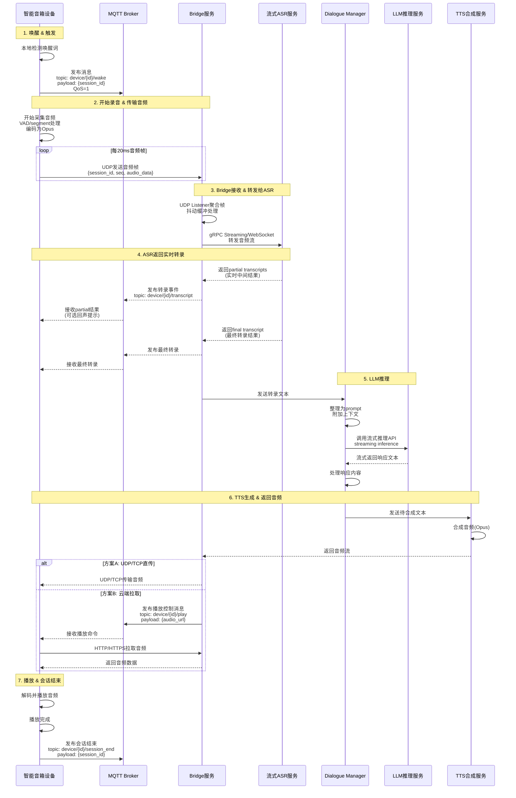

# 智能音箱端到端场景时序图

## 完整交互流程

## 关键技术点说明

### 通信协议选择
- **MQTT**: 用于控制信令（QoS=1保证至少一次送达）
- **UDP**: 用于实时音频传输（低延迟优先）
- **gRPC Streaming/WebSocket**: 用于Bridge到ASR的可靠流式传输

### 数据格式
- **音频编码**: Opus（20ms帧）
- **消息载荷**: JSON格式，包含session_id用于会话跟踪

### 性能优化
- VAD（Voice Activity Detection）：减少静音传输
- 抖动缓冲：平滑网络波动
- 流式处理：ASR、LLM均支持流式，降低端到端延迟

### QoS保证
- MQTT QoS=1：确保关键控制消息送达
- UDP音频传输：容忍少量丢包，优先低延迟
- 序列号（seq）：用于检测丢包和乱序
