# 智能音箱端到端系统完整架构

- [智能音箱端到端系统完整架构](#智能音箱端到端系统完整架构)
  - [系统架构总览](#系统架构总览)
    - [应用服务层详细功能](#应用服务层详细功能)
      - [🔌 API Gateway 核心功能](#-api-gateway-核心功能)
      - [🌉 Bridge 服务核心功能](#-bridge-服务核心功能)
      - [🎯 核心交互流程](#-核心交互流程)
  - [详细交互时序图](#详细交互时序图)
    - [场景概述](#场景概述)
    - [时序图](#时序图)
    - [场景详细说明](#场景详细说明)
      - [场景1: 用户通过Web界面查看设备列表](#场景1-用户通过web界面查看设备列表)
      - [场景2: 用户通过Web界面配置设备音量](#场景2-用户通过web界面配置设备音量)
      - [场景3: 设备唤醒并完成对话交互（核心场景）](#场景3-设备唤醒并完成对话交互核心场景)
      - [场景4: 实时状态推送（WebSocket）](#场景4-实时状态推送websocket)
    - [场景对比总结](#场景对比总结)
  - [技术架构分层视图](#技术架构分层视图)
  - [数据流向图](#数据流向图)
    - [数据流向详细说明](#数据流向详细说明)
      - [1. 音频上行链路 - 低延迟优先](#1-音频上行链路---低延迟优先)
        - [ASR服务多后端支持](#asr服务多后端支持)
      - [2. 音频下行链路 - WebSocket Push方案](#2-音频下行链路---websocket-push方案)
      - [3. 控制信令链路 - 可靠性优先](#3-控制信令链路---可靠性优先)
      - [4. 数据持久化](#4-数据持久化)
  - [部署架构图](#部署架构图)
  - [核心技术栈总结](#核心技术栈总结)
    - [前端层](#前端层)
    - [后端层 (Rust)](#后端层-rust)
    - [中间件层](#中间件层)
    - [AI服务层 (EchoKit)](#ai服务层-echokit)
    - [基础设施](#基础设施)
  - [关键性能指标](#关键性能指标)
    - [延迟要求](#延迟要求)
    - [吞吐量要求](#吞吐量要求)
    - [可用性要求](#可用性要求)
  - [安全架构](#安全架构)
  - [扩展性设计](#扩展性设计)
    - [水平扩展能力](#水平扩展能力)
    - [垂直扩展能力](#垂直扩展能力)
  - [监控与可观测性](#监控与可观测性)
  - [关键设计原则](#关键设计原则)
    - [1. 性能优先](#1-性能优先)
    - [2. 安全可靠](#2-安全可靠)
    - [3. 可扩展性](#3-可扩展性)
    - [4. 可维护性](#4-可维护性)
    - [5. 用户体验](#5-用户体验)

## 系统架构总览

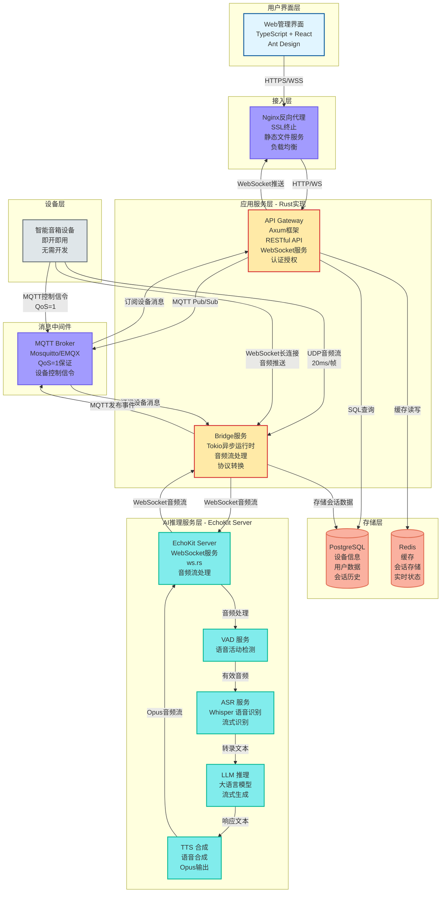

### 应用服务层详细功能

应用服务层采用 Rust 实现高性能和内存安全，包含 API Gateway 和 Bridge 两个核心服务组件：

#### 🔌 API Gateway 核心功能

**1. RESTful API 服务**
- 提供 HTTP 接口供 Web 管理界面调用
- 设备管理 API（增删改查设备信息）
- 用户认证和授权 API
- 会话历史查询 API

**2. WebSocket 服务**
- 建立和维护与 Web 前端的 WebSocket 连接
- 实时推送设备状态更新给前端
- 推送会话进度通知（识别中、思考中、合成中等）

**3. 认证授权**
- JWT Token 验证
- RBAC 权限控制
- 用户身份验证和设备归属权限检查

**4. MQTT 消息处理**
- 订阅设备状态主题（`device/+/status`）
- 发布设备控制命令（音量调节、重启等）
- 处理设备 ACK 确认消息

**5. 数据处理**
- 缓存管理（Redis 缓存设备列表，TTL=60s）
- 数据库查询（PostgreSQL）
- 数据过滤和权限检查

#### 🌉 Bridge 服务核心功能

**1. 音频流处理**
- 接收设备的 UDP 音频流（20ms/帧）
- 音频流聚合和抖动缓冲
- Opus 音频解码/编码

**2. 协议转换**

- UDP 音频数据转换为 WebSocket 流
- 与 EchoKit Server 建立双向音频通信
- 管理 EchoKit 会话生命周期

**3. WebSocket 连接管理**
- 维护与设备的 WebSocket 长连接
- 通过 WebSocket 下发合成好的音频流
- 连接池管理（支持 10,000+ 并发连接）

**4. 会话管理**
- 创建和管理语音交互会话
- 会话状态跟踪
- 会话数据持久化

**5. 音频分发**
- 接收 TTS 合成的音频流
- 通过 WebSocket 推送音频帧给设备
- 流量控制和缓冲区管理

#### 🎯 核心交互流程

1. **设备唤醒** → 接收 MQTT 唤醒事件，创建会话
2. **音频上行** → UDP 接收 → WebSocket 转发 → EchoKit Server
3. **AI 推理** → EchoKit 内部完成 ASR → LLM → TTS 处理链路
4. **音频下行** → EchoKit 返回音频 → WebSocket 推送给设备
5. **实时推送** → 设备状态变化 → MQTT → WebSocket → Web 前端

应用服务层是整个系统的中枢，负责协议转换、数据流转和实时通信，确保 Web 管理界面和智能音箱设备之间的可靠交互。

## 详细交互时序图

### 场景概述

系统涉及四个核心交互场景：
1. **场景1：设备列表查询** - 典型的Web管理操作，展示缓存策略
2. **场景2：设备远程配置** - Web到设备的控制链路，展示MQTT消息流
3. **场景3：语音交互全流程** - 核心业务场景，展示音频处理和AI推理完整链路
4. **场景4：实时状态推送** - WebSocket双向通信，展示实时监控能力

### 时序图

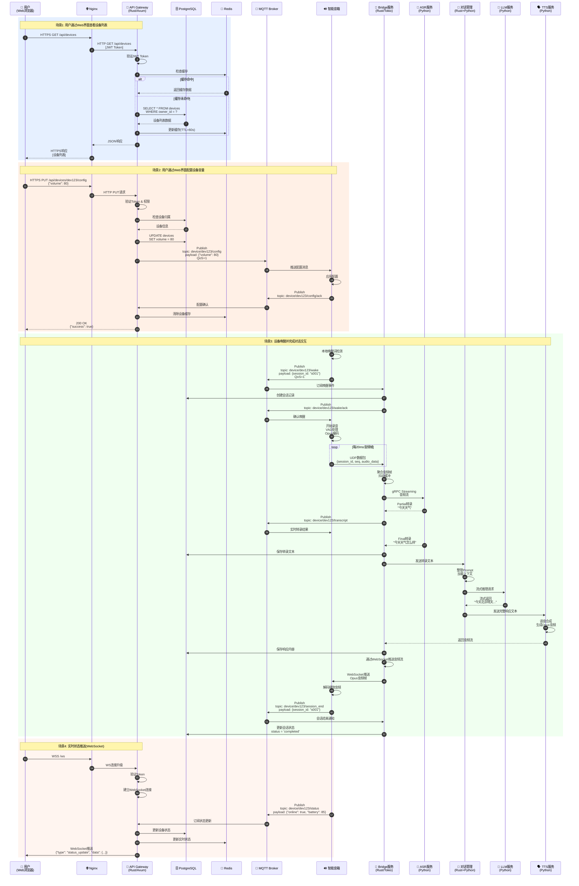

### 场景详细说明

#### 场景1: 用户通过Web界面查看设备列表

**业务场景**：用户登录Web管理界面后，查看自己名下的所有智能音箱设备。

**流程说明**：
1. **用户发起请求**：用户在浏览器中访问设备列表页面，前端发起HTTPS GET请求到 `/api/devices`
2. **Nginx转发**：Nginx作为反向代理，接收HTTPS请求并转发给后端API Gateway
3. **身份验证**：API Gateway首先验证请求中的JWT Token，确认用户身份合法
4. **缓存检查**：验证通过后，Gateway先查询Redis缓存
   - **缓存命中**：如果缓存存在且未过期，直接返回缓存数据（快速路径）
   - **缓存未命中**：查询PostgreSQL数据库获取该用户的设备列表
5. **数据库查询**：执行SQL `SELECT * FROM devices WHERE owner_id = ?`，获取用户的所有设备
6. **更新缓存**：将查询结果写入Redis缓存，设置TTL为60秒
7. **返回响应**：Gateway返回JSON格式的设备列表，经Nginx转发回用户浏览器

**技术要点**：
- 使用Redis缓存减少数据库访问压力
- JWT Token保证API安全性
- 缓存TTL设置平衡实时性和性能

**性能指标**：
- 缓存命中时延迟：< 50ms
- 缓存未命中时延迟：< 200ms

---

#### 场景2: 用户通过Web界面配置设备音量

**业务场景**：用户在Web界面上调整某个智能音箱的音量，系统需要将配置实时推送到设备。

**流程说明**：
1. **用户提交配置**：用户在设备详情页调整音量滑块，前端发起HTTPS PUT请求到 `/api/devices/dev123/config`，Body包含 `{"volume": 80}`
2. **身份和权限验证**：API Gateway验证JWT Token，并检查用户是否有权限配置该设备
3. **设备归属验证**：从PostgreSQL查询设备信息，确认该设备属于当前用户
4. **更新数据库**：执行SQL `UPDATE devices SET volume = 80 WHERE id = 'dev123'`，持久化配置
5. **发布MQTT消息**：Gateway通过MQTT Broker发布消息到主题 `device/dev123/config`，QoS设为1保证消息至少送达一次
6. **设备接收并应用**：智能音箱订阅了该主题，接收到消息后立即调整音量
7. **设备确认**：设备应用配置后，发布确认消息到 `device/dev123/config/ack`
8. **清除缓存**：Gateway接收到确认后，清除Redis中该设备的缓存，确保下次查询获取最新数据
9. **返回成功**：Gateway返回200 OK，前端显示配置成功提示

**技术要点**：
- MQTT QoS=1保证控制命令可靠送达
- 数据库先更新再发送MQTT，保证配置持久化
- 缓存失效策略保证数据一致性
- 设备ACK机制提供可靠反馈

**交互模式**：
- Web → API Gateway → MQTT → Device（控制流）
- Device → MQTT → API Gateway（反馈流）

---

#### 场景3: 设备唤醒并完成对话交互（核心场景）

**业务场景**：用户对智能音箱说"小智小智，今天天气怎么样？"，设备完成从唤醒、识别、推理到语音播放的完整交互。

**流程说明**：

**阶段1：唤醒与会话建立**
1. **本地唤醒检测**：设备通过本地算法检测到唤醒词"小智小智"
2. **发布唤醒事件**：设备通过MQTT发布消息到 `device/dev123/wake`，包含新生成的会话ID `session_id: "s001"`
3. **Bridge响应**：Bridge服务订阅了唤醒事件，接收到消息后在PostgreSQL中创建会话记录
4. **确认唤醒并建立连接**：Bridge发布ACK消息，设备收到后进入录音模式；同时设备与Bridge建立WebSocket长连接（`wss://bridge.domain.com/ws/audio`），用于后续音频下发，连接携带设备认证Token

**阶段2：音频采集与上传**
5. **开始录音**：设备启动麦克风采集，同时进行VAD（语音活动检测）处理
6. **音频编码**：将音频编码为Opus格式，每20ms生成一个音频帧
7. **UDP传输**：设备通过UDP协议将音频帧发送给Bridge服务，每个数据包包含 `{session_id, seq, audio_data}`
   - 使用UDP而非TCP，优先低延迟而非可靠性
   - 序列号seq用于检测丢包和乱序

**阶段3：语音识别**
8. **音频流聚合**：Bridge接收UDP数据包，进行抖动缓冲处理，平滑网络波动
9. **转发ASR**：Bridge通过gRPC Streaming将音频流转发给ASR服务
10. **实时转录**：ASR返回部分转录结果（Partial Transcript）如"今天天气"，Bridge通过MQTT推送给设备（可选用于回声显示）
11. **最终转录**：ASR返回完整转录结果"今天天气怎么样"
12. **保存转录**：Bridge将最终转录文本保存到PostgreSQL

**阶段4：对话管理与LLM推理**
13. **发送到DM**：Bridge将转录文本发送给Dialogue Manager
14. **整理Prompt**：DM加载用户的历史对话上下文，整理成完整的Prompt
15. **调用LLM**：DM向LLM服务发起流式推理请求
16. **流式返回**：LLM流式生成响应"今天北京晴天，最高气温25度..."
   - 流式生成降低首字延迟，用户体验更好

**阶段5：语音合成**
17. **TTS合成**：DM将完整响应文本发送给TTS服务
18. **生成音频**：TTS将文本合成为Opus格式的音频流
19. **返回Bridge**：TTS将音频流返回给Bridge服务
20. **保存响应**：Bridge将响应内容保存到PostgreSQL

**阶段6：音频下发与播放（WebSocket Push）**

21. **WebSocket推送音频**：Bridge服务通过已建立的WebSocket连接推送音频帧到设备
   - 连接复用：使用设备唤醒时建立的WebSocket长连接
   - 音频格式：Opus编码，每20ms一帧
   - 消息格式：`{"type": "audio_frame", "session_id": "s001", "seq": 1, "data": base64(opus_frame)}`
   - 流式推送：TTS边合成边推送，降低首字延迟

22. **播放音频**：设备接收WebSocket消息，解码Opus音频并通过扬声器播放
23. **会话结束**：播放完成后，设备发布会话结束消息到 `device/dev123/session_end`
24. **更新状态**：Bridge更新PostgreSQL中的会话状态为 `completed`

**技术要点**：
- UDP音频传输优先低延迟，容忍少量丢包
- 流式处理链路：ASR流式识别 + LLM流式生成，降低端到端延迟
- gRPC Streaming保证Bridge到ASR的可靠传输
- WebSocket长连接推送音频，NAT友好且可靠
- 抖动缓冲平滑网络波动
- 会话ID贯穿整个流程，便于追踪和调试

**性能指标**：
- 唤醒到录音：< 100ms
- ASR首字延迟：< 500ms
- LLM首Token：< 2s
- 音频推送延迟：100-200ms（WebSocket）
- 端到端总延迟：< 3s

**数据流**：
```
设备 → UDP → Bridge → gRPC → ASR → HTTP → DM → HTTP → LLM
                ↓                                      ↓
            PostgreSQL                              TTS
                                                     ↓
设备 ← UDP/HTTPS ← Bridge ← Opus音频流 ← TTS
```

---

#### 场景4: 实时状态推送（WebSocket）

**业务场景**：用户打开Web管理界面后，需要实时看到设备的在线状态、电量等信息变化。

**流程说明**：
1. **建立WebSocket连接**：
   - 用户浏览器发起WSS连接请求到 `/ws`
   - Nginx将WebSocket连接升级请求转发给API Gateway
   - Gateway验证JWT Token确保安全性
   - 验证通过后建立持久化WebSocket连接

2. **设备状态上报**：
   - 智能音箱定期（如每30秒）通过MQTT发布状态消息到 `device/dev123/status`
   - Payload包含：`{"online": true, "battery": 85, "volume": 80, "temperature": 35}`

3. **Gateway订阅与处理**：
   - API Gateway订阅了所有设备的状态主题 `device/+/status`
   - 接收到设备状态消息后：
     - 更新PostgreSQL中的设备状态（持久化）
     - 更新Redis中的实时状态（快速查询）
     - 判断哪些WebSocket连接需要接收该设备状态（权限过滤）

4. **实时推送**：
   - Gateway通过WebSocket推送消息给所有有权限的在线用户
   - 推送格式：`{"type": "status_update", "device_id": "dev123", "data": {"online": true, "battery": 85}}`
   - 前端接收后实时更新UI，用户无需刷新页面

**技术要点**：
- WebSocket保持长连接，避免HTTP轮询开销
- MQTT订阅通配符 `device/+/status` 监听所有设备
- 权限过滤：只推送用户有权查看的设备状态
- 双重存储：PostgreSQL持久化 + Redis实时缓存
- 心跳机制：检测WebSocket连接存活

**优势**：
- ✅ 实时性高：设备状态变化立即推送，延迟< 1s
- ✅ 服务器资源友好：避免大量HTTP轮询请求
- ✅ 用户体验好：界面实时更新，无需手动刷新

**扩展应用**：
- 会话进度通知（正在识别、正在思考、正在合成）
- 设备异常告警（离线、低电量、高温）
- 系统通知（固件更新可用）

---

### 场景对比总结

| 场景 | 通信协议 | 数据流向 | 核心目标 | 延迟要求 |
|------|---------|---------|---------|---------|
| 场景1：查询设备 | HTTPS | Web → Gateway → DB/Cache | 快速查询 | < 200ms |
| 场景2：配置设备 | HTTPS + MQTT | Web → Gateway → MQTT → Device | 可靠控制 | < 1s |
| 场景3：语音交互 | UDP + gRPC + MQTT | Device → Bridge → AI → Device | 低延迟交互 | < 3s |
| 场景4：状态推送 | MQTT + WebSocket | Device → MQTT → Gateway → Web | 实时监控 | < 1s |

**设计理念**：
- **查询场景**：缓存优先，提升响应速度
- **控制场景**：MQTT QoS保证，确保命令送达
- **音频场景**：UDP + 流式处理，极致低延迟
- **推送场景**：WebSocket长连接，减少开销

## 技术架构分层视图

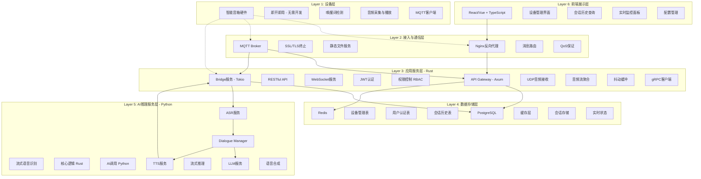

## 数据流向图

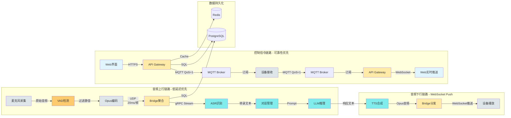

### 数据流向详细说明

系统存在条主要数据流链路，每条链路针对不同的业务需求进行了专门优化。

#### 1. 音频上行链路 - 低延迟优先

**目标**：将用户语音尽快传递给AI服务进行识别和理解。

**数据流向**：

```mermaid
flowchart LR
    DEV1[麦克风采集<br/>16kHz采样] -->|原始音频| VAD[VAD处理<br/>语音活动检测]
    VAD -->|过滤静音| ENC[Opus编码<br/>20ms/帧]
    ENC -->|UDP传输<br/>~320字节/帧| BR1[Bridge聚合<br/>抖动缓冲]
    BR1 -->|gRPC Stream| ASR1[ASR识别<br/>流式转录]
    ASR1 -->|转录文本| DM1[对话管理<br/>上下文整理]
    DM1 -->|Prompt| LLM1[LLM推理<br/>流式生成]

    style DEV1 fill:#dfe6e9,stroke:#636e72,stroke-width:2px
    style VAD fill:#fdcb6e,stroke:#e17055,stroke-width:2px
    style ENC fill:#dfe6e9,stroke:#636e72,stroke-width:2px
    style BR1 fill:#ffeaa7,stroke:#d63031,stroke-width:2px
    style ASR1 fill:#81ecec,stroke:#00b894,stroke-width:2px
    style DM1 fill:#81ecec,stroke:#00b894,stroke-width:2px
    style LLM1 fill:#81ecec,stroke:#00b894,stroke-width:2px
```

**详细说明**：

1. **麦克风音频采集**
   - 采样率：16kHz
   - 位深度：16-bit PCM
   - 单声道输入
   - 持续采集，无需手动开启

2. **VAD语音活动检测**
   - **目的**：过滤静音段，减少网络传输和计算开销
   - **算法**：WebRTC VAD 或基于能量的VAD
   - **阈值**：检测到语音能量超过阈值时开始传输
   - **效果**：节省约40-60%的带宽和计算资源
   - **延迟**：增加约20-50ms（可接受）

3. **Opus音频编码**
   - 编码格式：Opus（专为低延迟优化）
   - 帧长度：20ms
   - 码率：16-24kbps（语音模式）
   - 压缩后帧大小：约320字节/帧
   - 编码延迟：< 5ms

4. **UDP音频传输**
   - **为什么选UDP**：优先低延迟，可容忍<5%丢包率
   - 每个数据包包含：`{session_id, seq, timestamp, audio_data}`
   - 序列号用于检测丢包和乱序
   - 无重传机制，避免队头阻塞
   - 带宽占用：约16-24kbps（经VAD过滤后实际更低）

5. **Bridge音频聚合**
   - 接收UDP数据包，按session_id分组
   - **抖动缓冲**：缓存50-100ms的音频帧，平滑网络波动
   - 丢包处理：轻微丢包时插入静音帧，严重丢包时丢弃会话
   - 重排序：根据seq号重新排序乱序包

6. **gRPC流式转发**
   - Bridge通过gRPC Streaming连接ASR服务
   - 双向流：上行发送音频，下行接收转录结果
   - 保证可靠性：gRPC基于HTTP/2，有重传机制
   - 背压控制：ASR处理慢时自动限流

7. **ASR流式识别**
   - 流式识别算法：边接收边识别
   - 返回Partial结果：每1-2秒返回中间结果
   - 返回Final结果：语音结束后返回最终转录
   - GPU加速：单GPU可支持50+并发流

8. **对话管理处理**
   - 接收ASR转录文本
   - 加载用户历史上下文（最近5轮对话）
   - 意图识别和槽位提取
   - 构造完整的LLM Prompt

9. **LLM流式推理**
   - 接收Prompt并开始推理
   - 流式生成：每生成几个token就返回一次
   - 首Token延迟：< 500ms
   - 生成速度：约50 tokens/秒

**性能特点**：
- ✅ **端到端延迟低**：从说话到识别完成约1-2秒
- ✅ **实时反馈**：用户可以看到识别的中间结果
- ⚠️ **丢包容忍**：少量丢包不影响识别准确率
- ⚠️ **带宽占用**：每路约64kbps（Opus编码后）

**优化技巧**：
- 使用UDP多播可减少网络传输
- 边缘节点部署Bridge减少RTT
- ASR模型量化降低推理延迟
- LLM使用vLLM等高效推理引擎

---

##### ASR服务多后端支持

系统设计支持**多种ASR后端**，包括自建服务和第三方云API，提供灵活的部署选择。

**支持的ASR后端类型**：

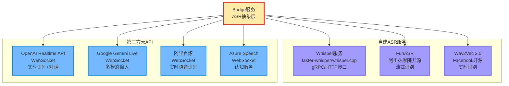

**架构设计：ASR抽象层**

Bridge服务通过统一的抽象接口支持多种ASR后端：

```rust
// ASR后端统一接口
#[async_trait]
pub trait AsrBackend: Send + Sync {
    /// 流式识别音频
    async fn recognize_stream(
        &self,
        audio_stream: AudioStream,
        config: RecognitionConfig,
    ) -> Result<TranscriptStream>;

    /// 获取后端类型
    fn backend_type(&self) -> AsrBackendType;

    /// 健康检查
    async fn health_check(&self) -> Result<bool>;
}

// 后端类型枚举
pub enum AsrBackendType {
    SelfHostedGrpc,      // 自建gRPC服务（Whisper等）
    SelfHostedHttp,      // 自建HTTP服务
    OpenAIRealtime,      // OpenAI Realtime API
    GeminiLive,          // Google Gemini Live
    AliBailian,          // 阿里百炼
    AzureSpeech,         // Azure语音服务
}

// 识别配置
pub struct RecognitionConfig {
    pub language: String,           // zh-CN, en-US
    pub sample_rate: u32,           // 16000
    pub enable_partial: bool,       // 是否返回中间结果
    pub enable_vad: bool,           // 是否启用VAD
    pub max_alternatives: u32,      // 最大候选数
}

// 转录结果流
pub struct TranscriptStream {
    pub session_id: String,
    pub results: ReceiverStream<TranscriptResult>,
}

pub struct TranscriptResult {
    pub text: String,
    pub is_final: bool,
    pub confidence: f32,
    pub words: Option<Vec<Word>>,
}
```

**具体实现示例**：

**1. 自建Whisper服务（gRPC）**

```rust
pub struct WhisperGrpcBackend {
    client: WhisperClient,
    config: WhisperConfig,
}

#[async_trait]
impl AsrBackend for WhisperGrpcBackend {
    async fn recognize_stream(
        &self,
        audio_stream: AudioStream,
        config: RecognitionConfig,
    ) -> Result<TranscriptStream> {
        let request = tonic::Request::new(audio_stream);
        let response = self.client.streaming_recognize(request).await?;

        let results = response.into_inner().map(|result| TranscriptResult {
            text: result.text,
            is_final: result.is_final,
            confidence: result.confidence,
            words: None,
        });

        Ok(TranscriptStream {
            session_id: uuid::Uuid::new_v4().to_string(),
            results: ReceiverStream::new(results),
        })
    }

    fn backend_type(&self) -> AsrBackendType {
        AsrBackendType::SelfHostedGrpc
    }
}
```

**2. OpenAI Realtime API（WebSocket）**

```rust
pub struct OpenAIRealtimeBackend {
    api_key: String,
    base_url: String,
}

#[async_trait]
impl AsrBackend for OpenAIRealtimeBackend {
    async fn recognize_stream(
        &self,
        mut audio_stream: AudioStream,
        config: RecognitionConfig,
    ) -> Result<TranscriptStream> {
        // 建立WebSocket连接
        let url = format!("{}/v1/realtime?model=gpt-4o-realtime-preview", self.base_url);
        let (mut ws, _) = connect_async(url).await?;

        // 发送会话配置
        ws.send(Message::Text(serde_json::to_string(&json!({
            "type": "session.update",
            "session": {
                "modalities": ["text", "audio"],
                "input_audio_format": "pcm16",
                "input_audio_transcription": {
                    "model": "whisper-1"
                }
            }
        }))?)).await?;

        // 创建结果通道
        let (tx, rx) = mpsc::channel(100);

        // 异步任务：发送音频
        tokio::spawn(async move {
            while let Some(frame) = audio_stream.next().await {
                let audio_b64 = base64::encode(&frame.data);
                ws.send(Message::Text(serde_json::to_string(&json!({
                    "type": "input_audio_buffer.append",
                    "audio": audio_b64
                }))?)).await?;
            }

            // 提交音频缓冲区
            ws.send(Message::Text(serde_json::to_string(&json!({
                "type": "input_audio_buffer.commit"
            }))?)).await?;
        });

        // 异步任务：接收转录结果
        tokio::spawn(async move {
            while let Some(msg) = ws.next().await {
                if let Message::Text(text) = msg? {
                    let event: serde_json::Value = serde_json::from_str(&text)?;

                    if event["type"] == "conversation.item.input_audio_transcription.completed" {
                        tx.send(TranscriptResult {
                            text: event["transcript"].as_str().unwrap().to_string(),
                            is_final: true,
                            confidence: 1.0,
                            words: None,
                        }).await?;
                    }
                }
            }
        });

        Ok(TranscriptStream {
            session_id: uuid::Uuid::new_v4().to_string(),
            results: ReceiverStream::new(rx),
        })
    }

    fn backend_type(&self) -> AsrBackendType {
        AsrBackendType::OpenAIRealtime
    }
}
```

**3. 阿里百炼实时API（WebSocket）**

```rust
pub struct AliBailianBackend {
    api_key: String,
    app_id: String,
}

#[async_trait]
impl AsrBackend for AliBailianBackend {
    async fn recognize_stream(
        &self,
        mut audio_stream: AudioStream,
        config: RecognitionConfig,
    ) -> Result<TranscriptStream> {
        let url = "wss://nls-gateway.cn-shanghai.aliyuncs.com/ws/v1";
        let (mut ws, _) = connect_async(url).await?;

        // 发送开始识别请求
        ws.send(Message::Text(serde_json::to_string(&json!({
            "header": {
                "message_id": uuid::Uuid::new_v4().to_string(),
                "task_id": uuid::Uuid::new_v4().to_string(),
                "namespace": "SpeechTranscriber",
                "name": "StartTranscription",
                "appkey": self.app_id
            },
            "payload": {
                "format": "opus",
                "sample_rate": 16000,
                "enable_intermediate_result": config.enable_partial,
                "enable_punctuation_prediction": true,
                "enable_inverse_text_normalization": true
            }
        }))?)).await?;

        // 发送音频和接收结果的逻辑...
        // （类似OpenAI实现）

        todo!()
    }

    fn backend_type(&self) -> AsrBackendType {
        AsrBackendType::AliBailian
    }
}
```

**ASR后端管理器**

```rust
pub struct AsrBackendManager {
    primary: Arc<dyn AsrBackend>,
    fallback: Option<Arc<dyn AsrBackend>>,
    metrics: Arc<Metrics>,
}

impl AsrBackendManager {
    /// 智能路由：自动选择可用后端
    pub async fn recognize_with_fallback(
        &self,
        audio_stream: AudioStream,
        config: RecognitionConfig,
    ) -> Result<TranscriptStream> {
        // 尝试主后端
        match self.primary.recognize_stream(audio_stream.clone(), config.clone()).await {
            Ok(result) => {
                self.metrics.record_success(self.primary.backend_type());
                Ok(result)
            }
            Err(e) => {
                warn!("Primary ASR backend failed: {}, trying fallback", e);
                self.metrics.record_failure(self.primary.backend_type());

                // 尝试备用后端
                if let Some(fallback) = &self.fallback {
                    fallback.recognize_stream(audio_stream, config).await
                } else {
                    Err(e)
                }
            }
        }
    }

    /// 并行识别：同时使用多个后端，取最快结果
    pub async fn recognize_with_race(
        &self,
        audio_stream: AudioStream,
        backends: Vec<Arc<dyn AsrBackend>>,
    ) -> Result<TranscriptStream> {
        let tasks: Vec<_> = backends
            .into_iter()
            .map(|backend| {
                let stream = audio_stream.clone();
                tokio::spawn(async move {
                    backend.recognize_stream(stream, RecognitionConfig::default()).await
                })
            })
            .collect();

        // 返回最快完成的结果
        let (result, _index, _remaining) = futures::future::select_all(tasks).await;
        result?
    }
}
```

**配置文件示例（config.yaml）**

```yaml
asr:
  # 主要后端
  primary:
    type: self_hosted_grpc  # self_hosted_grpc | openai | gemini | alibaba | azure
    endpoint: "localhost:50051"
    model: "whisper-large-v3"
    language: "zh-CN"

  # 备用后端（可选）
  fallback:
    type: openai
    api_key: "${OPENAI_API_KEY}"
    model: "whisper-1"

  # 高级配置
  settings:
    enable_partial_results: true
    enable_vad: true
    timeout: 30s
    max_retries: 3

  # 成本控制（云API）
  cost_control:
    max_requests_per_minute: 100
    max_audio_minutes_per_day: 1000
```

**各后端对比**

| 特性 | 自建Whisper | FunASR | OpenAI API | Gemini Live | 阿里百炼 |
|------|------------|--------|-----------|-------------|---------|
| **部署方式** | 自托管 | 自托管 | 云API | 云API | 云API |
| **协议** | gRPC/HTTP | gRPC/HTTP | WebSocket | WebSocket | WebSocket |
| **延迟** | 200-500ms | 150-300ms | 500-800ms | 400-700ms | 300-600ms |
| **准确率** | 高 | 高 | 很高 | 很高 | 高 |
| **成本** | 固定（GPU） | 固定（GPU） | 按量付费 | 按量付费 | 按量付费 |
| **并发能力** | 50+（单GPU） | 100+（单GPU） | 无限制 | 无限制 | 无限制 |
| **隐私性** | ✅ 数据不出内网 | ✅ 数据不出内网 | ⚠️ 上传到云端 | ⚠️ 上传到云端 | ⚠️ 上传到云端 |
| **流式识别** | ✅ | ✅ | ✅ | ✅ | ✅ |
| **多语言** | ✅ 100+语言 | ✅ 中英日韩 | ✅ 50+语言 | ✅ 100+语言 | ✅ 中英为主 |
| **定制化** | ✅ 可微调 | ✅ 可微调 | ❌ | ❌ | ⚠️ 部分支持 |
| **推荐场景** | 高隐私、大规模 | 国内、高性能 | 快速上线、中小规模 | 多模态需求 | 国内合规 |

**推荐策略**：

1. **初期快速上线**：使用第三方云API（OpenAI/阿里百炼）
2. **规模扩大后**：主后端切换为自建Whisper，云API作为备用
3. **混合策略**：自建处理常规流量，云API处理峰值流量
4. **成本优化**：根据实时负载动态切换后端

**性能影响**：

| 指标 | 自建ASR | 云端API |
|------|---------|---------|
| ASR延迟 | 200-500ms | 400-800ms |
| 端到端延迟 | 3.5-4.0s | 3.8-4.3s |
| 网络依赖 | 内网（低） | 公网（中） |
| 可用性 | 99.9%+ | 99.95%+ |

---

#### 2. 音频下行链路 - WebSocket Push方案

**目标**：将AI生成的语音通过WebSocket可靠、快速地推送给设备播放。

**数据流向**：

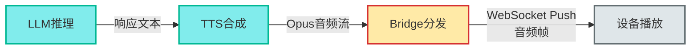

**详细说明**：

1. **LLM生成响应**
   - 流式生成完整响应文本
   - DM收集所有文本片段并拼接
   - 示例："今天北京晴天，最高气温25度，适合户外活动。"

2. **TTS语音合成**
   - 将完整文本送入TTS模型
   - 支持流式合成：边合成边返回音频帧
   - 输出格式：Opus编码，16kHz采样率
   - 合成速度：约10倍实时（1秒文本生成0.1秒音频）

3. **Bridge音频分发**
   - 接收TTS返回的音频流
   - 保存音频到PostgreSQL（归档）
   - 通过WebSocket推送给设备

**WebSocket Push方案详解**

**架构设计**：

```
设备唤醒 → 建立WebSocket连接 → 保持长连接
                ↓
    音频上行（UDP）+ 音频下行（WebSocket）双通道
                ↓
    会话结束 → 关闭WebSocket或保持心跳
```

**连接管理**：

1. **连接建立**
   - 设备唤醒时建立WebSocket连接到Bridge服务
   - 连接URL：`wss://bridge.domain.com/ws/audio`
   - 认证：连接时携带设备证书或Token
   - 连接池：Bridge维护所有在线设备的WebSocket连接映射

2. **连接复用**
   - 同一设备的多次对话复用同一WebSocket连接
   - 通过session_id区分不同会话
   - 减少连接建立开销，降低首字延迟

3. **心跳保活**
   - 设备每30秒发送Ping帧
   - Bridge响应Pong帧
   - 超过60秒无心跳则断开连接

**消息格式**：

```json
// 音频帧消息
{
    "type": "audio_frame",
    "session_id": "s001",
    "seq": 1,
    "timestamp": 1729456789000,
    "data": "base64_encoded_opus_frame",
    "is_final": false
}

// 播放开始通知
{
    "type": "play_start",
    "session_id": "s001",
    "total_frames": 150,
    "duration_ms": 3000
}

// 播放结束通知
{
    "type": "play_end",
    "session_id": "s001"
}
```

**流式推送流程**：

```rust
// Bridge端伪代码
async fn push_audio_to_device(device_id: &str, audio_stream: AudioStream) {
    // 获取设备的WebSocket连接
    let ws_conn = get_device_connection(device_id).await?;

    let mut seq = 0;

    // 发送播放开始通知
    ws_conn.send(PlayStart {
        session_id: audio_stream.session_id,
        total_frames: audio_stream.frame_count,
        duration_ms: audio_stream.duration,
    }).await?;

    // 流式推送音频帧
    while let Some(frame) = audio_stream.next().await {
        seq += 1;
        ws_conn.send(AudioFrame {
            session_id: audio_stream.session_id,
            seq,
            data: frame.encode_base64(),
            is_final: frame.is_last,
        }).await?;

        // 流量控制：每推送5帧检查一次缓冲区
        if seq % 5 == 0 {
            ws_conn.check_buffer().await?;
        }
    }

    // 发送播放结束通知
    ws_conn.send(PlayEnd {
        session_id: audio_stream.session_id,
    }).await?;
}
```

**设备端接收**：

```c
// ESP32-S3伪代码
void on_websocket_message(const char* message) {
    cJSON* json = cJSON_Parse(message);
    const char* type = cJSON_GetObjectItem(json, "type")->valuestring;

    if (strcmp(type, "play_start") == 0) {
        // 准备播放缓冲区
        audio_player_prepare();
    }
    else if (strcmp(type, "audio_frame") == 0) {
        // 解码音频帧
        const char* data_b64 = cJSON_GetObjectItem(json, "data")->valuestring;
        uint8_t* opus_frame = base64_decode(data_b64);

        // Opus解码
        int16_t pcm_buffer[320];
        opus_decode(opus_decoder, opus_frame, frame_size, pcm_buffer, 320, 0);

        // 送入播放队列
        audio_player_enqueue(pcm_buffer, 320);
    }
    else if (strcmp(type, "play_end") == 0) {
        // 播放完成
        audio_player_finish();
    }

    cJSON_Delete(json);
}
```

**优势分析**：

✅ **NAT友好**：
- 设备主动发起WebSocket连接，无需公网IP
- 无需复杂的NAT穿透或STUN/TURN服务器
- 适合家庭网络环境

✅ **可靠传输**：
- 基于TCP，保证数据顺序和完整性
- 自动重传机制，避免音频帧丢失
- 避免UDP丢包导致的爆音问题

✅ **双向通信**：
- 同一连接上行发送控制命令，下行接收音频
- 减少连接数量，降低资源消耗
- 实时反馈播放进度和错误

✅ **流量控制**：
- WebSocket内置背压机制
- Bridge根据设备接收速度动态调整推送速率
- 避免网络拥塞和缓冲区溢出

✅ **安全可靠**：
- WSS（WebSocket Secure）加密传输
- 支持设备证书认证
- 防止中间人攻击和窃听

**性能特点**：

| 指标 | WebSocket Push |
|------|---------------|
| 延迟 | 100-200ms |
| 可靠性 | 高（TCP保证） |
| NAT穿透 | 无需（主动连接） |
| 连接开销 | 低（长连接复用） |
| 实现复杂度 | 中等 |
| 资源占用 | 中等（每连接约100KB内存） |
| 适用场景 | 公网、家庭网络、企业网络 |

**降级方案**：

当WebSocket连接异常时，自动降级到HTTPS拉取：

```rust
async fn fallback_to_https(device_id: &str, audio_data: Vec<u8>) -> Result<()> {
    // 存储音频到Redis
    let token = generate_secure_token();
    redis.setex(&token, 60, &audio_data).await?;

    // 通过MQTT通知设备拉取
    let url = format!("https://api.domain.com/audio/{}", token);
    mqtt.publish(
        &format!("device/{}/play", device_id),
        json!({"audio_url": url, "mode": "fallback"})
    ).await?;

    Ok(())
}
```

**资源占用估算（ESP32-S3）**：

- WebSocket客户端库：约50KB Flash + 20KB RAM
- 音频播放缓冲区：约64KB（2秒音频）
- Opus解码器：约30KB Flash + 40KB RAM
- 总计：约80KB Flash + 124KB RAM（在512KB SRAM范围内）

**实现要点**：

1. **帧大小优化**：每帧20ms，平衡延迟和开销
2. **缓冲区管理**：设备侧维护至少100ms的播放缓冲
3. **错误恢复**：检测到帧丢失时请求重传或跳过
4. **连接重连**：断线后自动重连，恢复未完成的会话
5. **多设备支持**：Bridge需支持10,000+并发WebSocket连接

---

#### 3. 控制信令链路 - 可靠性优先

**目标**：确保Web和设备之间的控制命令可靠送达。

**数据流向（双向）**：

**下行控制流**：


**上行反馈流**：

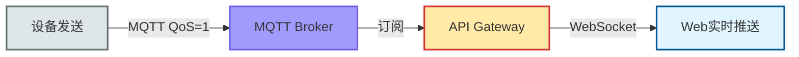

**详细说明**：

1. **Web发起控制**
   - 用户操作：调整音量、重启设备、固件升级等
   - 前端发送HTTPS PUT/POST请求
   - 携带JWT Token认证

2. **API Gateway处理**
   - 验证JWT Token和用户权限
   - 更新数据库（持久化配置）
   - 构造MQTT消息

3. **MQTT消息发布**
   - **主题设计**：`device/{device_id}/{command}`
     - `device/dev123/config` - 配置更新
     - `device/dev123/reboot` - 重启命令
     - `device/dev123/upgrade` - 固件升级
   - **QoS=1**：至少送达一次，确保消息不丢失
   - **Retain标志**：重要配置使用Retain，设备重连后仍能收到

4. **MQTT Broker路由**
   - 根据主题匹配订阅列表
   - 将消息推送给所有订阅者
   - 如果设备离线，消息暂存（根据QoS）

5. **设备接收并执行**
   - 订阅了所有相关主题：`device/dev123/#`
   - 接收消息后解析并执行
   - 执行结果发布到ACK主题：`device/dev123/config/ack`

6. **反馈流回传**
   - 设备状态变化：在线/离线、电量、温度等
   - 定期心跳：每30秒发布一次状态
   - 发布到：`device/dev123/status`

7. **API Gateway订阅**
   - 订阅所有设备状态：`device/+/status`
   - 订阅所有ACK：`device/+/*/ack`
   - 通配符`+`匹配单层，`#`匹配多层

8. **WebSocket实时推送**
   - Gateway收到设备消息后
   - 过滤：只推送给有权限的用户
   - 推送格式：`{"type": "device_status", "device_id": "dev123", "data": {...}}`
   - 前端实时更新UI

**MQTT主题设计**：

```
device/
  ├── {device_id}/
  │   ├── wake              # 唤醒事件
  │   ├── wake/ack          # 唤醒确认
  │   ├── config            # 配置命令
  │   ├── config/ack        # 配置确认
  │   ├── reboot            # 重启命令
  │   ├── upgrade           # 升级命令
  │   ├── status            # 状态上报
  │   ├── transcript        # 转录结果
  │   ├── play              # 播放命令
  │   └── session_end       # 会话结束
```

**可靠性保证**：

1. **QoS级别选择**
   - **QoS=0**（最多一次）：心跳消息（丢了无所谓）
   - **QoS=1**（至少一次）：控制命令、状态上报
   - **QoS=2**（恰好一次）：不使用（开销太大）

2. **消息持久化**
   - 设备离线时，QoS=1消息暂存在Broker
   - 设备重连后自动接收未送达的消息
   - 过期策略：24小时后丢弃

3. **ACK机制**
   - 所有重要命令都需要设备ACK
   - Gateway等待ACK超时：5秒
   - 超时后重试或报错

4. **会话保持**
   - MQTT使用Clean Session=false
   - 设备重连后恢复订阅
   - ClientID与device_id绑定

**性能特点**：
- ✅ **可靠送达**：QoS=1保证消息不丢
- ✅ **实时性好**：MQTT延迟< 100ms
- ✅ **扩展性强**：单Broker可支持10万+设备
- ✅ **离线支持**：设备离线时消息暂存

---

#### 4. 数据持久化

**目标**：将关键数据持久化存储，支持查询和分析。

**存储策略**：

**PostgreSQL（关系型数据库）**

**存储内容**：
- 用户账号信息（users表）
- 设备注册信息（devices表）
- 会话历史记录（sessions表）
- 转录与响应内容（transcripts表）
- 操作审计日志（audit_logs表）

**数据模型示例**：
```sql
-- 设备表
CREATE TABLE devices (
    id VARCHAR(64) PRIMARY KEY,
    owner_id VARCHAR(64) NOT NULL,
    name VARCHAR(255),
    status VARCHAR(32), -- online/offline
    volume INT,
    battery INT,
    created_at TIMESTAMP,
    updated_at TIMESTAMP
);

-- 会话表
CREATE TABLE sessions (
    id VARCHAR(64) PRIMARY KEY,
    device_id VARCHAR(64),
    user_query TEXT,
    ai_response TEXT,
    duration_ms INT,
    status VARCHAR(32), -- active/completed/failed
    created_at TIMESTAMP
);
```

**查询场景**：
- 用户查看设备列表
- 查看历史对话记录
- 统计分析（日活设备、对话次数）
- 审计日志查询

**Redis（缓存与临时存储）**

**存储内容**：
- 设备列表缓存（TTL=60s）
- 设备实时状态（TTL=300s）
- JWT Token黑名单
- 临时音频文件（TTL=30s）
- 限流计数器

**缓存策略**：
```rust
// 查询设备列表
let cache_key = format!("devices:user:{}", user_id);
if let Some(cached) = redis.get(&cache_key) {
    return cached; // 缓存命中
}

// 缓存未命中，查数据库
let devices = db.query("SELECT * FROM devices WHERE owner_id = ?", user_id);
redis.setex(&cache_key, 60, &devices); // 缓存60秒
return devices;
```

**缓存失效**：
- 时间失效：设置合理的TTL
- 主动失效：数据更新时清除缓存
- 懒惰删除：读取时检查是否过期

**数据流总结**：

| 链路 | 协议 | 优先级 | 可靠性 | 延迟 | 用途 |
|------|------|--------|--------|------|------|
| 音频上行 | UDP + gRPC | 低延迟 | 中 | < 500ms | 语音识别 |
| 音频下行 | WebSocket | 可靠性+低延迟 | 高 | 100-200ms | 语音播放 |
| 控制信令 | MQTT QoS=1 | 可靠性 | 高 | < 1s | 设备控制 |
| 数据持久化 | SQL | 一致性 | 最高 | 无要求 | 数据存储 |

**设计原则**：
- **音频上行**：UDP优先，牺牲可靠性换低延迟
- **音频下行**：WebSocket推送，平衡延迟、可靠性和NAT友好性
- **控制流**：MQTT QoS保证，确保命令送达
- **存储流**：SQL事务，保证数据一致性
- **缓存流**：Redis加速，平衡性能与实时性

## 部署架构图

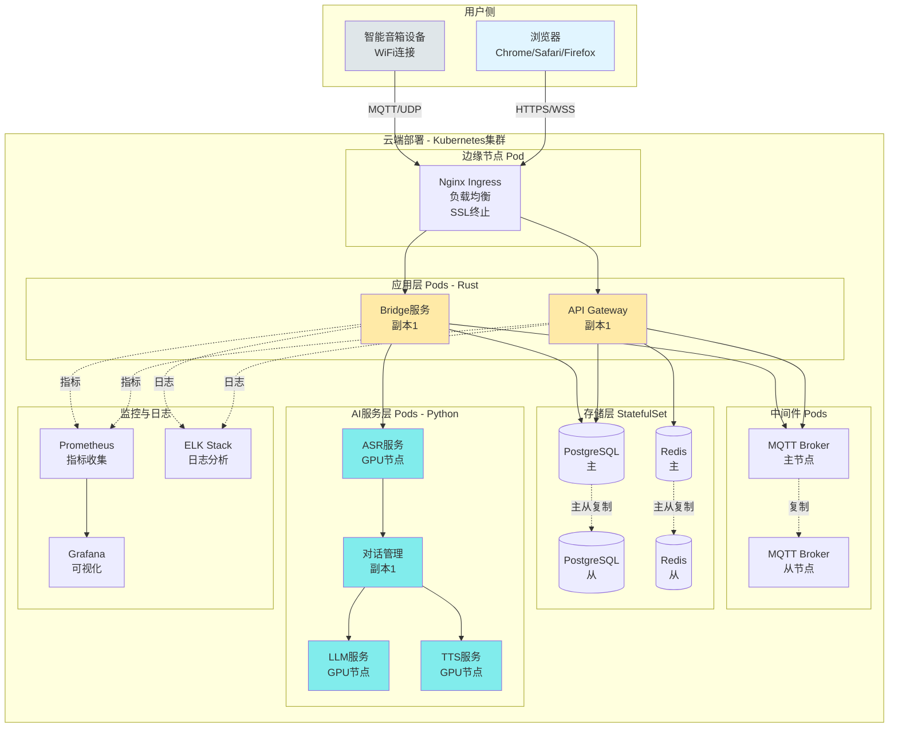

## 核心技术栈总结

### 前端层
| 组件 | 技术选型 | 说明 |
|------|---------|------|
| UI框架 | React 18 + TypeScript | 类型安全,生态丰富 |
| 状态管理 | Zustand / Redux Toolkit | 轻量级状态管理 |
| UI组件库 | Ant Design | 企业级组件库 |
| 数据请求 | TanStack Query | 数据获取与缓存 |
| 实时通信 | WebSocket API | 实时状态推送 |
| 构建工具 | Vite | 快速构建 |

### 后端层 (Rust)
| 组件 | 技术选型 | 说明 |
|------|---------|------|
| API Gateway | Axum | 现代化Web框架 |
| Bridge服务 | Tokio | 异步运行时 |
| gRPC客户端 | Tonic | gRPC框架 |
| MQTT客户端 | rumqttc | MQTT 3.1.1/5.0 |
| 数据库访问 | sqlx | 异步SQL |
| 音频编解码 | opus | Opus编解码 |
| 认证 | jsonwebtoken | JWT |

### 中间件层
| 组件 | 技术选型 | 说明 |
|------|---------|------|
| 反向代理 | Nginx | SSL终止,负载均衡 |
| 消息代理 | Mosquitto/EMQX | MQTT Broker |
| 关系数据库 | PostgreSQL 15+ | 事务支持 |
| 缓存 | Redis 7+ | 高性能缓存 |

### AI服务层 (EchoKit)
| 组件 | 技术选型 | 说明 |
|------|---------|------|
| EchoKit Server | Rust + WebSocket | 音频流处理核心 |
| VAD | WebRTC VAD | 语音活动检测 |
| ASR | Whisper | 流式语音识别 |
| LLM | OpenAI/本地模型 | 大语言模型推理 |
| TTS | Azure/本地模型 | 语音合成 |
| 音频编解码 | Opus | 高效音频压缩 |

### 基础设施
| 组件 | 技术选型 | 说明 |
|------|---------|------|
| 容器编排 | Kubernetes | 微服务部署 |
| 容器运行时 | Docker | 容器化 |
| 监控 | Prometheus + Grafana | 指标监控 |
| 日志 | ELK Stack | 日志分析 |
| CI/CD | GitHub Actions | 自动化部署 |

## 关键性能指标

### 延迟要求

- **唤醒响应**: < 100ms
- **音频上传**: 20ms/帧 (实时)
- **ASR识别**: < 500ms (首字延迟)
- **LLM推理**: < 2s (首Token)
- **TTS合成**: < 1s
- **WebSocket音频推送**: 100-200ms
- **端到端**: < 3.5s (从说话到播放)

### 吞吐量要求
- **并发设备**: 10,000+ 设备同时在线
- **API QPS**: 5,000+ 请求/秒
- **音频流**: 1,000+ 并发流
- **WebSocket连接**: 10,000+ 并发连接

### 可用性要求
- **系统可用性**: 99.9% (年停机时间 < 8.76小时)
- **数据持久性**: 99.999%
- **消息送达**: QoS=1 至少一次

## 安全架构

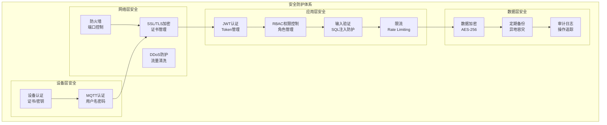

## 扩展性设计

### 水平扩展能力
- ✅ **API Gateway**: 无状态设计,可任意扩展Pod数量
- ✅ **Bridge服务**: 通过会话ID分片,独立扩展
- ✅ **AI服务**: GPU节点池,按需扩展
- ✅ **MQTT Broker**: 支持集群模式
- ✅ **数据库**: 读写分离,从库扩展

### 垂直扩展能力
- ✅ **增加CPU/内存**: 优化单实例性能
- ✅ **GPU升级**: AI推理加速
- ✅ **存储扩展**: 增加磁盘容量

## 监控与可观测性

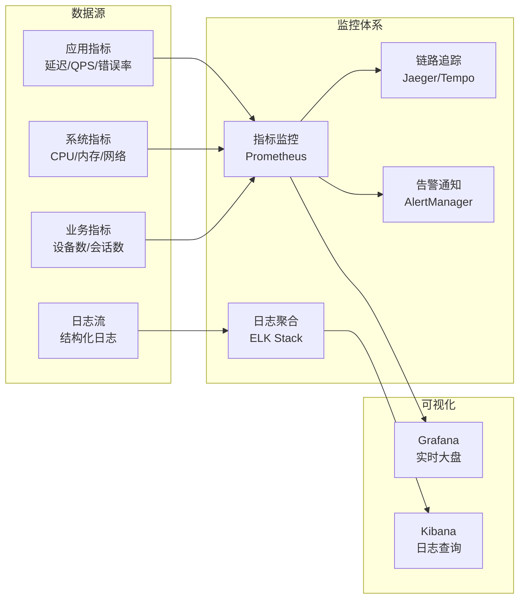

## 关键设计原则

### 1. 性能优先

- 音频上行走UDP，牺牲可靠性换取低延迟
- 音频下行走WebSocket，平衡延迟、可靠性和NAT友好性
- 控制信令走MQTT，保证可靠送达
- 异步非阻塞I/O (Tokio)
- 流式处理降低端到端延迟

### 2. 安全可靠
- JWT Token认证
- RBAC权限控制
- MQTT QoS=1保证消息送达
- 数据库事务保证一致性

### 3. 可扩展性
- 微服务架构,组件独立扩展
- 无状态设计,水平扩展
- 服务发现与负载均衡
- 缓存层减轻数据库压力

### 4. 可维护性
- 统一的日志格式
- 完善的监控告警
- 清晰的代码结构
- 完整的API文档

### 5. 用户体验
- 实时反馈 (WebSocket)
- 友好的Web界面
- 低延迟语音交互
- 可靠的消息送达

---

**文档版本**: v2.0 (EchoKit 集成版)
**创建日期**: 2025-10-17
**更新日期**: 2025-10-27
**技术栈**: Rust + TypeScript + EchoKit
**适用场景**: 智能音箱端到端系统设计
**主要更新**: 集成 EchoKit Server 作为 AI 推理服务层
