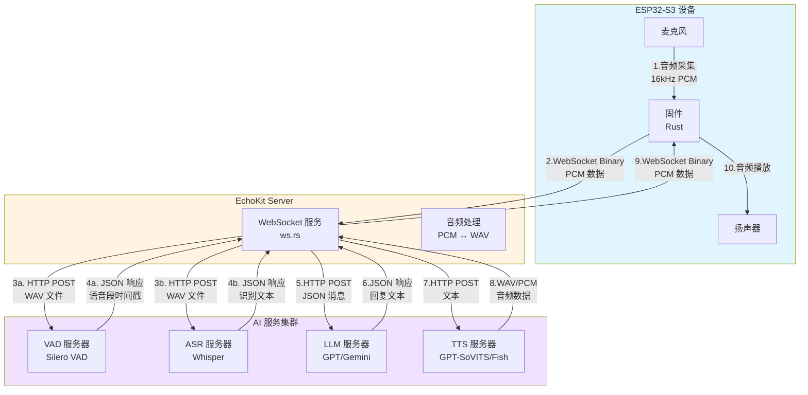
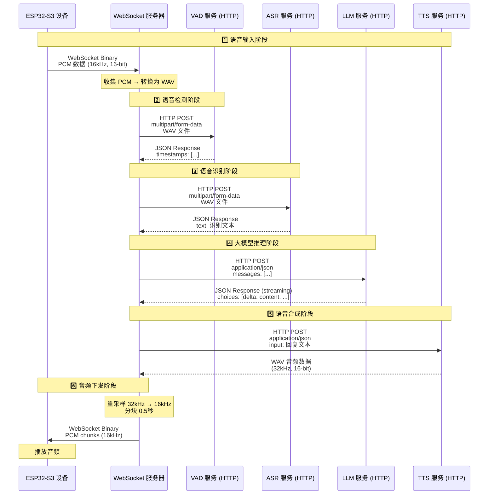
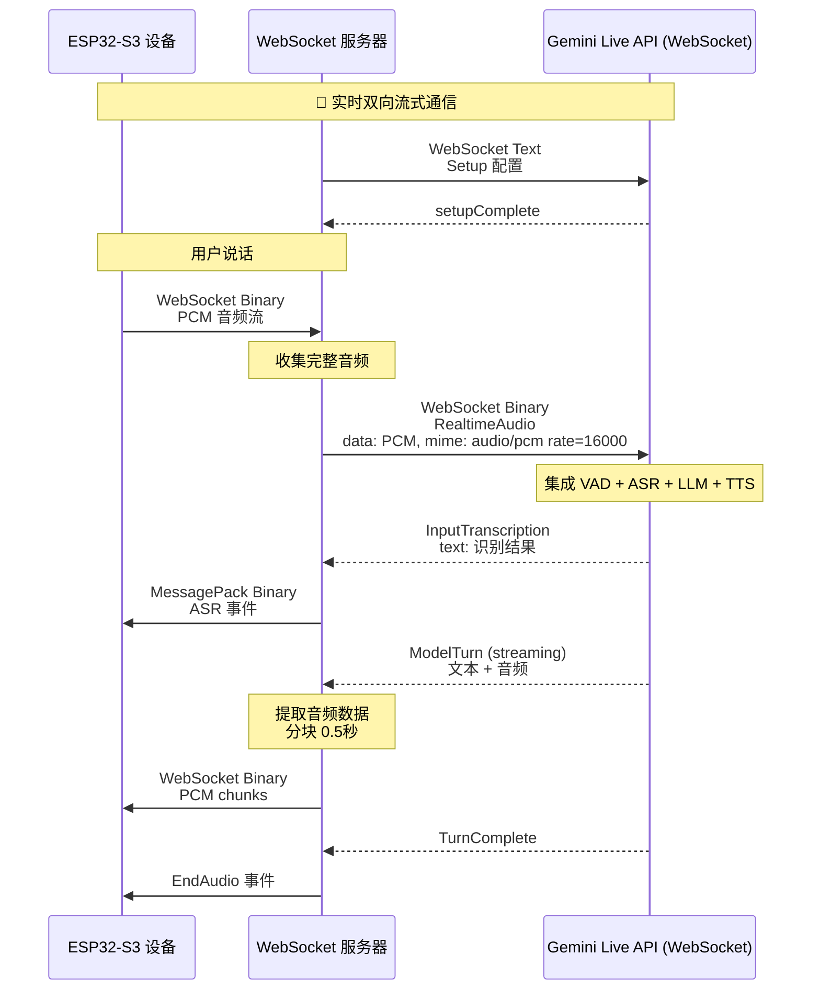
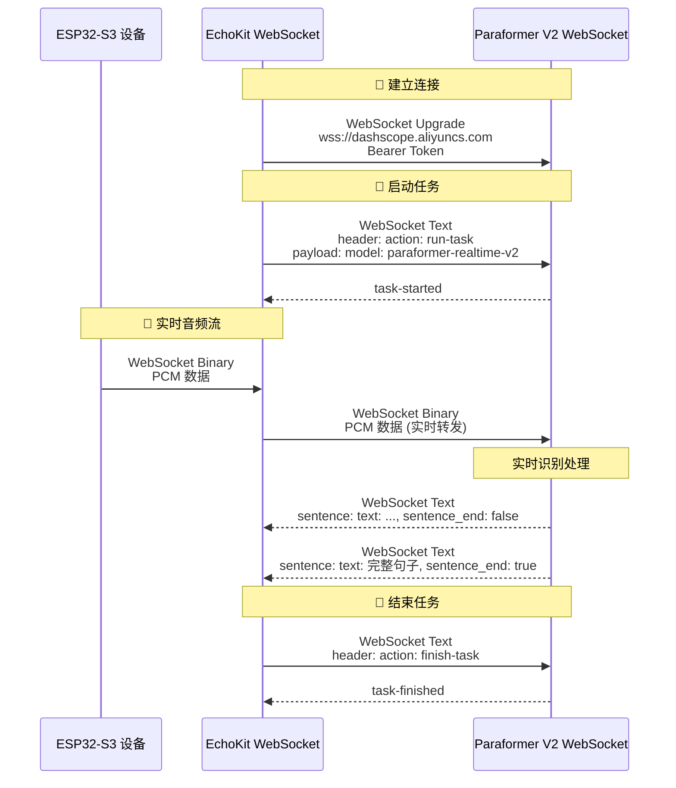
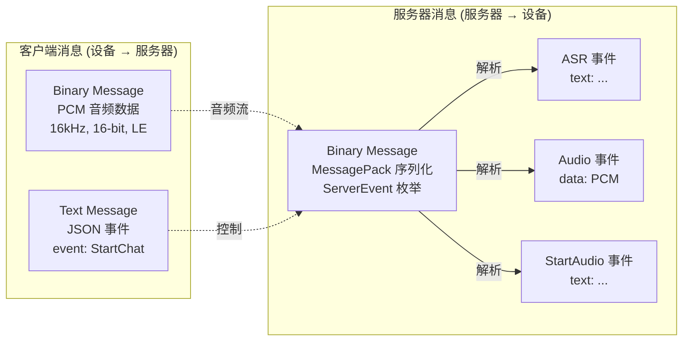
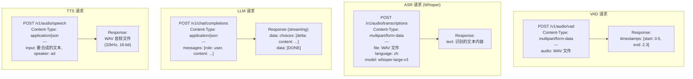
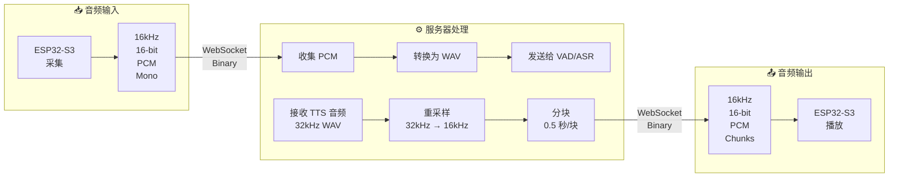
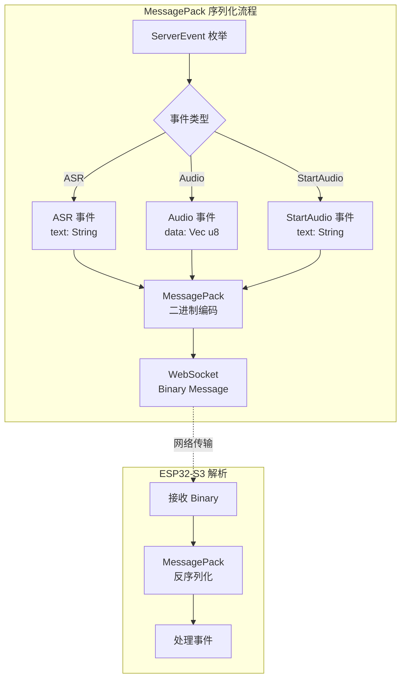

# EchoKit 数据流图

## 整体架构数据流

## 详细数据流（Standard 配置）

## Gemini Live 配置数据流

## Paraformer V2 实时 ASR 数据流

## 数据格式详解

### 1. WebSocket 消息格式（设备 ↔ 服务器）

### 2. HTTP 请求格式

## 音频处理流程

## 协议栈对比

| 组件 | 通信协议 | 数据格式 | 音频格式 | 特点 |
|------|---------|---------|---------|------|
| **设备 ↔ EchoKit** | WebSocket | Binary (PCM) + MessagePack | 16kHz, 16-bit PCM | 双向实时 |
| **EchoKit ↔ VAD** | HTTP POST | multipart/form-data | 16kHz WAV | 批处理 |
| **EchoKit ↔ ASR (Whisper)** | HTTP POST | multipart/form-data | 16kHz WAV | 批处理 |
| **EchoKit ↔ ASR (Paraformer)** | WebSocket | Binary (PCM) | 16kHz PCM | 实时流式 |
| **EchoKit ↔ LLM** | HTTP POST | JSON | 无音频 | 流式响应 |
| **EchoKit ↔ TTS** | HTTP POST | JSON | 32kHz WAV | 批处理/流式 |
| **EchoKit ↔ Gemini Live** | WebSocket | 自定义协议 | 16kHz PCM | 全集成实时 |

## 消息序列化

## 总结

### 🎯 核心数据流特点

1. **设备通信**：WebSocket + MessagePack 二进制序列化
2. **VAD 服务**：HTTP POST + multipart/form-data (批处理)
3. **ASR 服务**：
   - Whisper: HTTP POST + multipart/form-data (批处理)
   - Paraformer V2: WebSocket + 二进制流 (实时)
4. **LLM 服务**：HTTP POST + JSON (流式响应)
5. **TTS 服务**：HTTP POST + JSON → WAV 音频
6. **音频格式**：统一使用 16kHz, 16-bit, PCM, Mono

### 🔄 两种架构模式

**标准模式（Stable）：**

- VAD (HTTP) → ASR (HTTP) → LLM (HTTP) → TTS (HTTP)
- 每个服务独立调用，灵活可配置

**Gemini Live 模式：**

- 单一 WebSocket 连接完成所有功能
- VAD + ASR + LLM + TTS 全部集成
- 延迟更低，但灵活性降低
